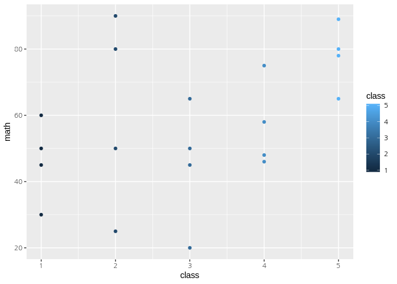

score
================
rhadoop
2019년 3월 12일

## R Markdown

This is an R Markdown document. Markdown is a simple formatting syntax
for authoring HTML, PDF, and MS Word documents. For more details on
using R Markdown see <http://rmarkdown.rstudio.com>.

When you click the **Knit** button a document will be generated that
includes both content as well as the output of any embedded R code
chunks within the document. You can embed an R code chunk like this:

``` r
library(readxl)
getwd()
```

    ## [1] "/project/03_src/R"

``` r
#read.csv("../Data/csv_exam.csv") -> df_csv
read_excel("Data/excel_exam.xlsx")-> df_excel
str(df_excel)
```

    ## Classes 'tbl_df', 'tbl' and 'data.frame':    20 obs. of  5 variables:
    ##  $ id     : num  1 2 3 4 5 6 7 8 9 10 ...
    ##  $ class  : num  1 1 1 1 2 2 2 2 3 3 ...
    ##  $ math   : num  50 60 45 30 25 50 80 90 20 50 ...
    ##  $ english: num  98 97 86 98 80 89 90 78 98 98 ...
    ##  $ science: num  50 60 78 58 65 98 45 25 15 45 ...

### 1.학급별 점수

``` r
df_excel[df_excel$class==1,]
```

    ## # A tibble: 4 x 5
    ##      id class  math english science
    ##   <dbl> <dbl> <dbl>   <dbl>   <dbl>
    ## 1    1.    1.   50.     98.     50.
    ## 2    2.    1.   60.     97.     60.
    ## 3    3.    1.   45.     86.     78.
    ## 4    4.    1.   30.     98.     58.

``` r
df_excel[df_excel$class==2,]
```

    ## # A tibble: 4 x 5
    ##      id class  math english science
    ##   <dbl> <dbl> <dbl>   <dbl>   <dbl>
    ## 1    5.    2.   25.     80.     65.
    ## 2    6.    2.   50.     89.     98.
    ## 3    7.    2.   80.     90.     45.
    ## 4    8.    2.   90.     78.     25.

``` r
df_excel[df_excel$class==3,]
```

    ## # A tibble: 4 x 5
    ##      id class  math english science
    ##   <dbl> <dbl> <dbl>   <dbl>   <dbl>
    ## 1    9.    3.   20.     98.     15.
    ## 2   10.    3.   50.     98.     45.
    ## 3   11.    3.   65.     65.     65.
    ## 4   12.    3.   45.     85.     32.

``` r
df_excel[df_excel$class==4,]
```

    ## # A tibble: 4 x 5
    ##      id class  math english science
    ##   <dbl> <dbl> <dbl>   <dbl>   <dbl>
    ## 1   13.    4.   46.     98.     65.
    ## 2   14.    4.   48.     87.     12.
    ## 3   15.    4.   75.     56.     78.
    ## 4   16.    4.   58.     98.     65.

``` r
df_excel[df_excel$class==5,]
```

    ## # A tibble: 4 x 5
    ##      id class  math english science
    ##   <dbl> <dbl> <dbl>   <dbl>   <dbl>
    ## 1   17.    5.   65.     68.     98.
    ## 2   18.    5.   80.     78.     90.
    ## 3   19.    5.   89.     68.     87.
    ## 4   20.    5.   78.     83.     58.

## Including Plots

You can also embed plots, for example:

``` r
library(ggplot2)
qplot(class, math, data=df_excel,geom='auto', color=class)
```

<!-- -->

Note that the `echo = FALSE` parameter was added to the code chunk to
prevent printing of the R code that generated the plot.
