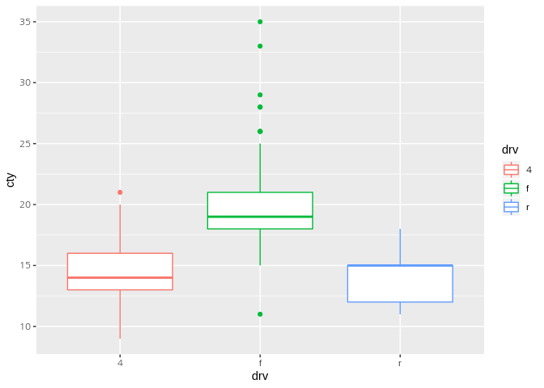
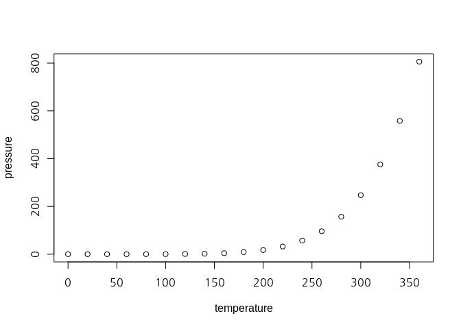

mpg
================
rhadoop
2019년 3월 12일

## R Markdown

This is an R Markdown document. Markdown is a simple formatting syntax
for authoring HTML, PDF, and MS Word documents. For more details on
using R Markdown see <http://rmarkdown.rstudio.com>.

When you click the **Knit** button a document will be generated that
includes both content as well as the output of any embedded R code
chunks within the document. You can embed an R code chunk like this:

``` r
library(ggplot2)
str((mpg))
```

    ## Classes 'tbl_df', 'tbl' and 'data.frame':    234 obs. of  11 variables:
    ##  $ manufacturer: chr  "audi" "audi" "audi" "audi" ...
    ##  $ model       : chr  "a4" "a4" "a4" "a4" ...
    ##  $ displ       : num  1.8 1.8 2 2 2.8 2.8 3.1 1.8 1.8 2 ...
    ##  $ year        : int  1999 1999 2008 2008 1999 1999 2008 1999 1999 2008 ...
    ##  $ cyl         : int  4 4 4 4 6 6 6 4 4 4 ...
    ##  $ trans       : chr  "auto(l5)" "manual(m5)" "manual(m6)" "auto(av)" ...
    ##  $ drv         : chr  "f" "f" "f" "f" ...
    ##  $ cty         : int  18 21 20 21 16 18 18 18 16 20 ...
    ##  $ hwy         : int  29 29 31 30 26 26 27 26 25 28 ...
    ##  $ fl          : chr  "p" "p" "p" "p" ...
    ##  $ class       : chr  "compact" "compact" "compact" "compact" ...

## Including Plots

You can also embed plots, for example:

``` r
qplot(drv,cty,data=mpg,geom="boxplot",color=drv)
```

<!-- -->

<!-- -->

Note that the `echo = FALSE` parameter was added to the code chunk to
prevent printing of the R code that generated the plot.
